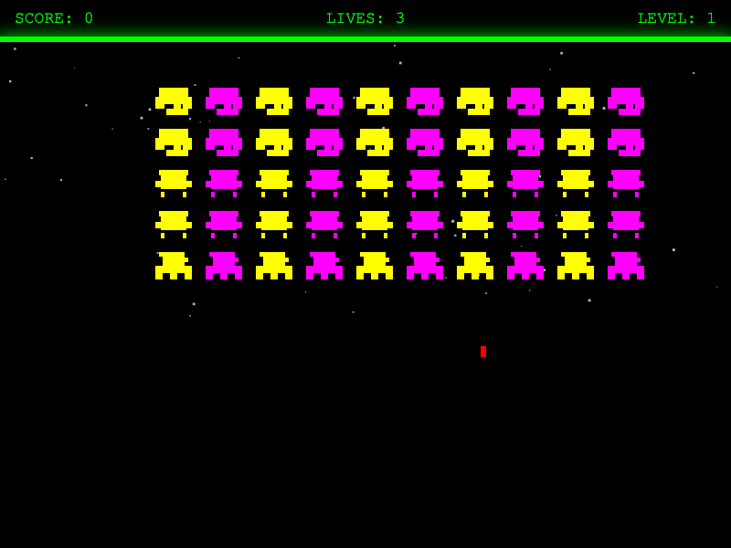
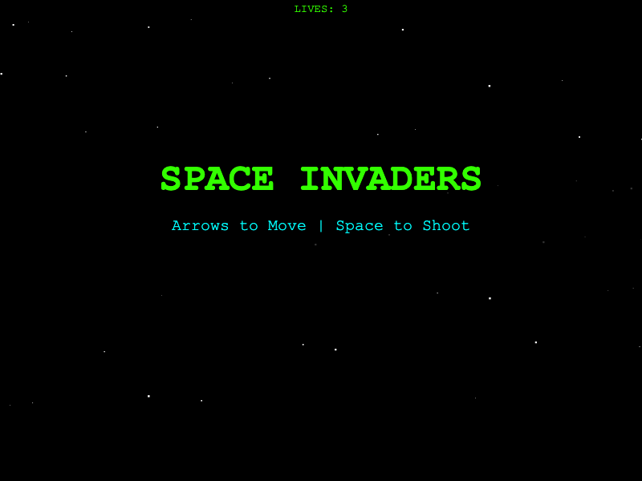

# Qwen 3.5 Space Invaders - Model Comparison

A comparison of Space Invaders games generated entirely by different flavours of the **Qwen 3.5** language model. Each variant was given the same prompt and produced a fully playable, single-file HTML game.

## How to Play

1. Download (or clone) this repository.
2. Open any of the `space-invaders.html` files directly in your browser — no server or build step required.
3. Use **Arrow Keys** to move and **Space** to shoot.

## Variants

### Qwen 3.5 27B

Located in [`27b/space-invaders.html`](27b/space-invaders.html)

Jumps straight into the action with colorful pixel-art invaders, a HUD showing score, lives and level, and a starfield background.

### Qwen 3.5 35B-A3B

Located in [`35b-a3b/space-invaders.html`](35b-a3b/space-invaders.html)

Features a title/start screen before gameplay begins, with a green-on-black retro arcade aesthetic and animated starfield.

